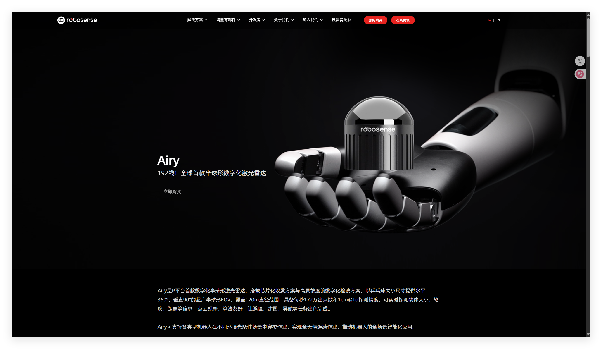
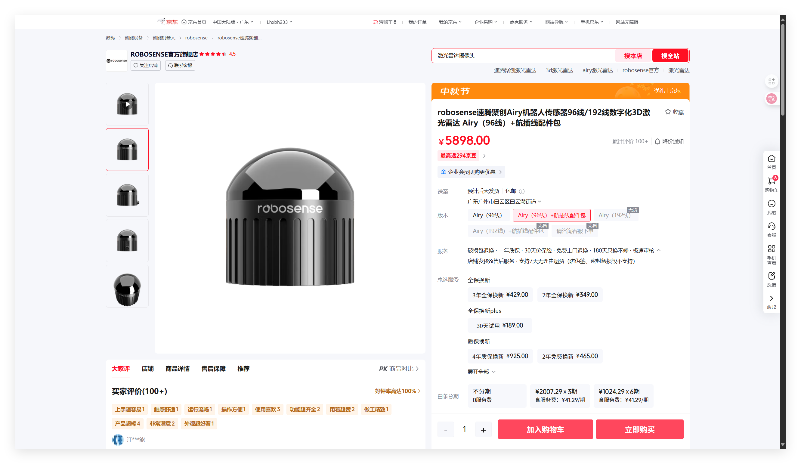
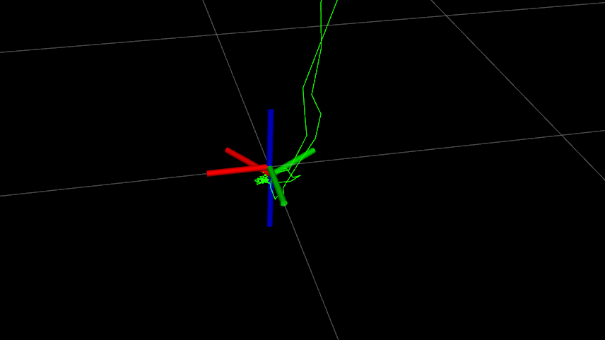
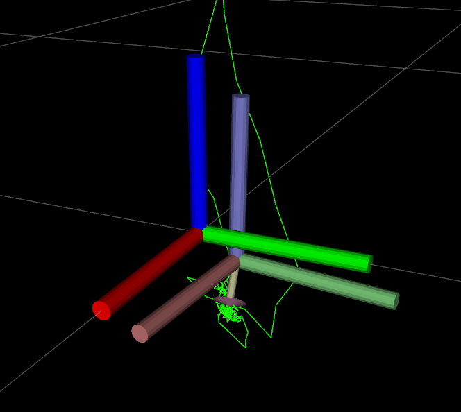

# Homework

最近，实验室来了个年轻人……

这是来自速腾聚创的Airy激光雷达，在京东的售价将近6000

线数高达96线，点云数据是MID360的四倍……
我的天哪Airy大人！这不是可以薄纱之前的MID360雷达?

然而，在部署环境进行了简单测试后，我们发现这个雷达运行定位算法时，定位总是会出现大幅度漂移。
经检查，我们修复了一个由于初始配置没有正确设置而导致的出现大量无效点云的问题。然而，还有一个更加严重的问题：

这个雷达的IMU数据与激光雷达点云数据的坐标轴居然不一样！

随后我们通过调整PointLIO算法的参数，使得算法能够正常运行。然而还是出现了PointLIO输出Frame坐标轴错误的问题。
错误坐标轴与正确坐标轴之间有如下关系：

- x -> -y
- y -> -x
- z -> -z

问题如图所示：

你能够将PointLIO输出的错误frame纠正过来吗？

## 作业要求

- **(10%)** 能使用正确的配置文件运行PointLIO。
- **(60%)** 创建一个名为 `airy_tf_corrector` 的节点，用于纠正PointLIO输出的frame。
- **(5%)** 创建一个配置文件。
- **(25%)** 创建一个launch文件用于读取配置文件中的信息，并在节点中使用到这些信息（例如：需要修改的frame名称）。

- **(额外10%)** 在正式赛场上，我们没有足够时间在实机上运行命令，也不能远程操控。因此，我们需要一个“一键启动”系统。
再创建一个节点，并编写launch文件，使得运行该launch文件后可以一键启动`airy_tf_corrector`和`PointLIO`两个节点。

Airy的数据存储在[OneDrive](https://1drv.ms/u/c/c4df1ae86af9d009/EQHLtefvX_tKo7yuNkc5JooBO3xT16mcqo9fW4UC2NL6Kw?e=Wh4ziW)中，其中记录了两个话题:

- 激光雷达点云话题: `rslidar_points`
- imu数据数据: `rslidar_imu_data`

## 提示:

1. 我们需要对错误的frame进行纠正。即遵循ROS的坐标系

   - X轴：向前（红色）
   - Y轴：向左（绿色）
   - Z轴：向上（蓝色）

2. 如果转换正确，在PointLIO启动时`lidar_link`的坐标朝向与`lidar_odom`一致。

3. 在整个运动过程中，激光雷达始终没有上下翻转。也就是说如果转换正确，z轴（蓝色）会始终朝上。

4. 激光雷达最后回到了原来的朝向。也就是说如果转换正确，在rosbag播放结束后，`lidar_link`在的坐标朝向与`lidar_odom`一致。

Edited by @ftyangjt
