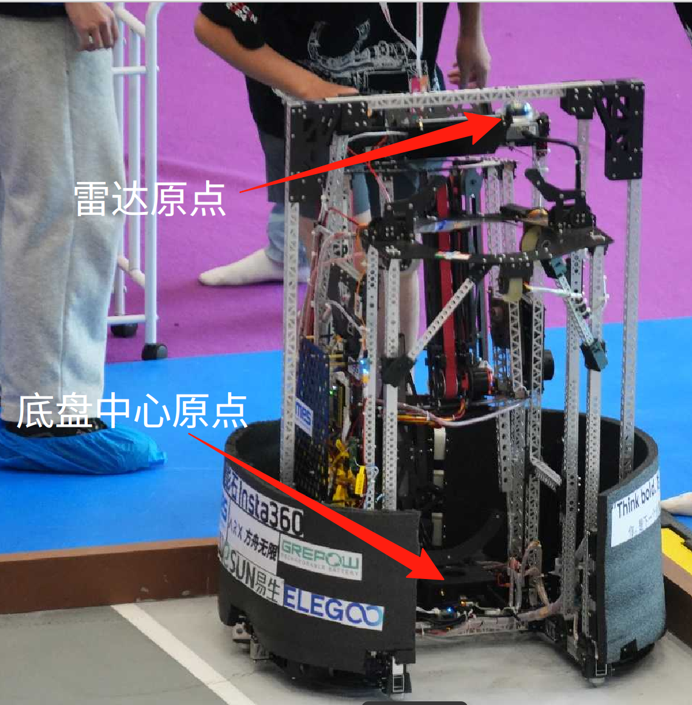
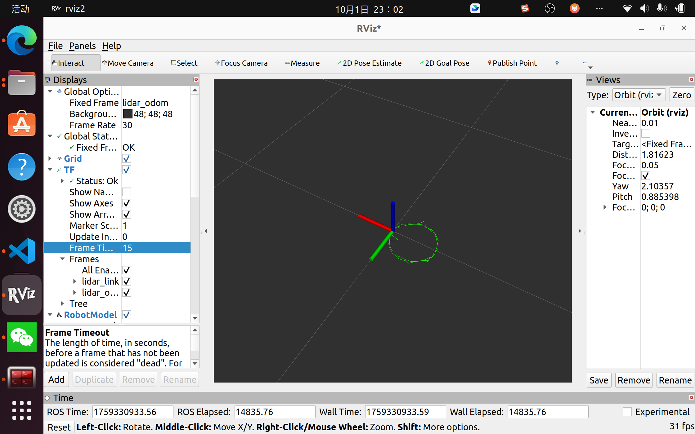
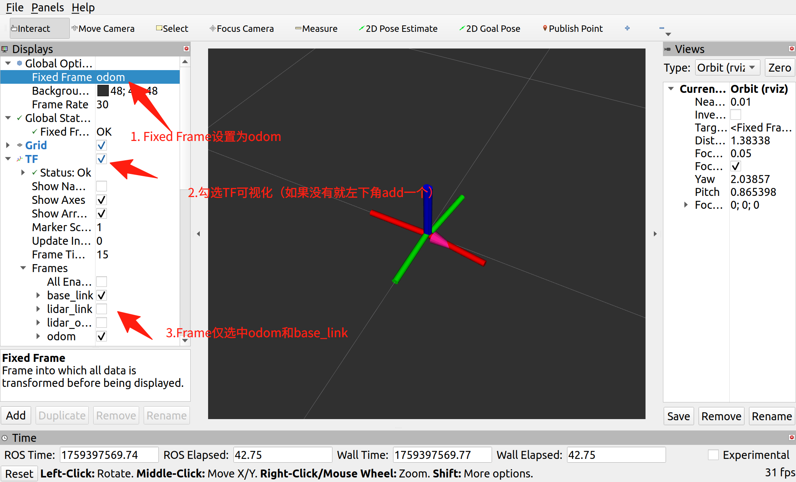
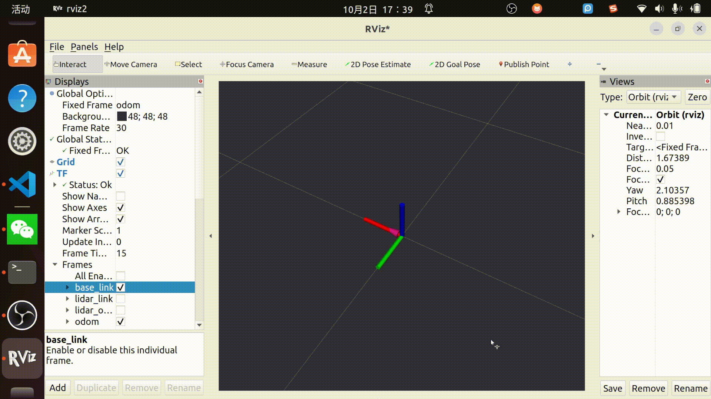

# **课程作业：激光雷达外参标定**

## 1. 背景
### 1.1 外参
在移动机器人技术中，精确了解各个传感器相对于机器人本体（即底盘中心）的位置至关重要。这种相对位姿关系被称为“外参”。

如图
- 底盘中心指的是**在机器人原地旋转时，坐标保持不变的点。**
- 雷达中心是Mid360雷达的中心。

如果外参不准，例如激光雷达（LiDAR）的位置有偏差，那么雷达扫描到的障碍物在机器人坐标系下的位置就是错误的，这将直接导致导航、定位和避障算法的失败。
本项目旨在解决一个常见的标定问题：**确定一个二维平面移动机器人上，激光雷达相对于其旋转中心的精确安装偏移：X, Y平移。**由于机器人进行平面运动，所以暂时不考虑Z轴平移。


### 1.2 激光里程计 (Lidar Odometry)

本项目所使用的数据来源于激光里程计（Lidar Odometry, LO）算法，例如`Point-LIO`。理解该算法输出的坐标系定义是进行后续标定工作的前提。
激光里程计通过连续处理激光雷达的点云数据，利用帧间匹配（Scan-to-Scan 或 Scan-to-Map）技术，实时递推估算传感器的位姿变化。在这一过程中，算法涉及两个核心的坐标系：

*   **`lidar_odom` (里程计坐标系/世界坐标系)**:
    这是一个**固定参考坐标系 (Fixed Frame)**。它的原点和姿态通常定义为激光里程计算法**启动时刻**雷达所处的位置和姿态。在后续的运行过程中，该坐标系保持静止不变，作为描述雷达运动轨迹的全局参考基准。

*   **`lidar_link` (传感器坐标系/本体坐标系)**:
    这是一个**移动坐标系 (Moving Frame)**，其原点固连在激光雷达的几何中心。它随着机器人的运动而运动。

激光里程计算法的核心输出，就是实时发布从 `lidar_odom` 到 `lidar_link` 的位姿变换（Transformation）。这个变换描述了**雷达中心当前时刻在里程计固定参考坐标系下的精确位置和姿态**。我们的标定工作正是基于对这一动态变换数据的分析与处理。


## 2. 实验数据集描述
本项目提供了一个预先录制好的ROS2 bag文件 (`output_bag`)，作为标定算法的输入数据。该数据集精确地捕捉了机器人执行特定标定动作时的传感器信息。
该`rosbag`文件包含了完成本次标定任务所需的关键数据流，主要包括以下两个话题：

*   **`/tf`**: 此话题以高频率发布由`Point-LIO`激光里程计算法实时解算出的坐标系变换。具体来说，它提供了从固定的里程计坐标系 `lidar_odom` 到移动的雷达坐标系 `lidar_link` 的动态变换。这是我们进行数据分析和轨迹提取的核心数据源。

*   **`/path` (`nav_msgs/Path`)**: 为了便于直观地观察，此话题记录并累积了`lidar_link`坐标系的历史轨迹。通过在RViz2中可视化此话题，可以直接看到传感器走过的路径。

该数据集的录制过程遵循了特定的实验规程：首先，在静止状态下启动`Point-LIO`算法以建立`lidar_odom`坐标系的原点；然后，控制机器人平台在原地**连续旋转两周**。由于激光雷达传感器并非完美地安装在机器人的几何旋转中心，这一原地旋转的动作使得`lidar_link`的轨迹在`lidar_odom`坐标系下呈现为一个清晰的**圆形**，如下图所示。




## 3. 作业目标
根据rosbag，找到底盘中心到激光雷达中心的外参，即X，Y偏移量。

## 4. 评分标准


本次作业将分为三个递进的阶段，分别对应不同的难度和分值。完成所有阶段即可获得满分。
---
#### **第一阶段：轨迹数据分析与半径计算 (基础部分 - 40分)**

此阶段的目标是验证你具备基础的数据处理和几何分析能力。

**要求：**
1.  编写一个ROS2 Python节点，能够成功订阅`/tf`话题并记录`lidar_link`在`lidar_odom`坐标系下的轨迹点`(x, y)`。
2.  实现圆拟合算法，对采集到的轨迹点进行处理。
3.  给出计算出的轨迹圆的**半径 R**。
---

#### **第二阶段：机器人外参标定 (核心部分 - 40分)**
此阶段的目标是让你将几何计算结果与机器人的物理结构联系起来，完成核心的标定任务。

**要求：**
根据圆心和轨迹点，推导出从机器人旋转中心（即`base_link`）到激光雷达中心（`lidar_link`）的**XY平面偏移向量**。

---

#### **第三阶段：全局坐标系对齐与系统验证 (挑战部分 - 20分)**

机器人运动学中，通常用`odom`表示全局里程计坐标系，`base_link`表示机器人本体坐标系。
外参标定的最后一步便是发布静态变换，**使得tf关系能表征出`机器人本体中心`到`激光雷达中心`的物理距离关系。**

**要求：**
根据第二阶段计算出的XY偏移值，使用`tf2_ros`功能包下的节点：`static_transform_publisher`发布两条静态TF变换：
1.  `odom`到`lidar_odom`的变换为第二阶段计算出的XY偏移值。
2.  `base_link`到`lidar_link`的变换为第二阶段计算出的XY偏移值。   

> 提示：由于lidar_link的父节点为lidar_odom，而一个tf节点不能有两个父节点，所以静态变换2应该**发布`lidar_link`到`base_link`的变换**，而不是`base_link`到`lidar_link`的变换。偏移值为计算出来的偏移值的负值。



> 如图所示

## 5. 提交内容：
### python脚本：`lidar_extrinsic_calibration.py`
当我运行命令
```bash
python lidar_extrinsic_calibration.py
# 新开一个终端
ros2 bag play output_bag
```
时，最终会输出：
   1. 轨迹圆的半径R（第一阶段）
   2. 计算出的`base_link`到`lidar_link`的XY偏移值（第二阶段）
### 报告：`年级_专业_名字.md`
1. 包含运行结果的完整截图，展示轨迹圆的半径值。（第一阶段）
2. 包含运行结果的完整截图，展示XY偏移值。（第二阶段）
3. 两句静态变换的完整命令。（第三阶段）
4. RViz截图，其中`Fixed Frame`设置为`odom`，在`display`仪表盘中，添加tf话题，`Frame`仅勾选`odom`和`base_link`,能清晰地展示`base_link`坐标系正在`odom`坐标系的原点处进行**原地旋转**。(第三阶段)


> 注：哪个阶段如果做不出来也可以提交，不同阶段分开算分